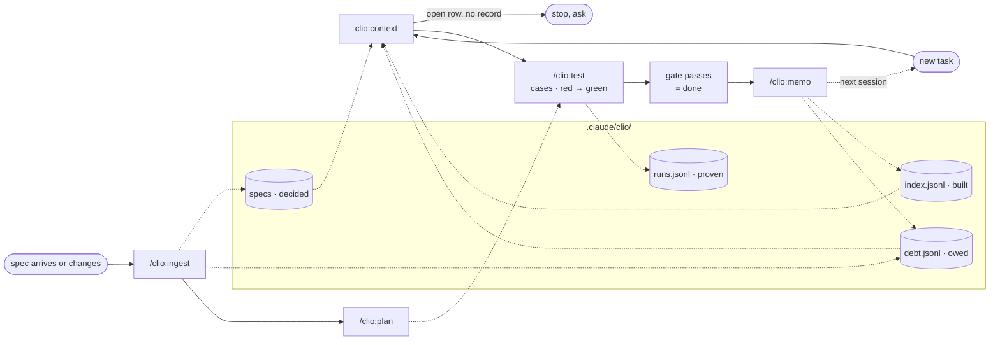

<div align="center">
  

  # Clio

  **A project-memory kit for `.claude/`: layout, ledgers, and the loop that keeps them true.**
  Claude reads what was decided, built and owed before it works, and asks instead of guessing.

  It is not auto-memory. Nothing is written unless you asked for it.

  [](https://code.claude.com/docs/en/plugins)
  [](CHANGELOG.md)
  [](LICENSE)
</div>

<br>

What Claude reads before touching code:

```text
clio:context checkout

Spec      memory/checkout.md · rows 3–5 · row 4 open: tax rounding rule owed by PO since 08-12
Built     2026-08-20 checkout-orders.md — GET /orders, pagination 50/page (commit 3f2a1c)
Owed      cart-rounding · code-debt · CartService.php:52 · blocked_by: null   ← work queue
          tax-rule-open · spec-blocked · waiting on PO                        ← do not start
Next      plan 3.3 — orders list filters by status · levels: unit, api, concurrency · 4 cases, gate: 3.3-c1 never run
```

Row 4 is open, so Claude asks about it instead of inventing a rounding rule.

## Why

Every session starts from zero. `CLAUDE.md` grows into a dump of rules, task notes and half-true
facts; the agent reads all of it, still cannot tell what was *decided* from what was merely *built*,
and fills the gap with a plausible answer.

Clio changes the layout rather than the model. Each kind of knowledge gets one place, "unverified"
becomes a valid answer, and a short loop writes the session back to disk before it ends.

## Quick start

```bash
claude plugin marketplace add nhhthong/clio
claude plugin install clio@nhhthong
```

Then, once per repository:

```text
/clio:setup                  # creates .claude/clio/docs/ and .claude/clio/database/
/clio:ingest docs/spec.md    # distils the spec into areas and proposes the stack (row 0)
/clio:plan infra             # the stack → toolchain/scaffold tasks and rules/<stack>.md
/clio:plan checkout          # split one spec area into researched, testable tasks
```

From there, per task: Claude runs `clio:context` before non-trivial work, `/clio:test` designs
and proves it, you run `/clio:memo` after. A hook notices when you skip the memo — see
[The loop](#the-loop).

Requires `bash`, `jq`, `git`, `awk` and `sed`. Setup writes nothing outside `.claude/clio/`, and a
plugin update writes nothing inside it.

## How it differs

| | Clio | Auto-memory (claude-mem, mem0…) | Skills packs (mattpocock/skills, superpowers…) |
|---|---|---|---|
| Writes | only when you ask, by command or in plain words; never on the agent's own initiative | automatically, every session | CONTEXT.md / ADRs at most; no ledger |
| Installs into your repo | a layout you keep even if you drop the plugin | nothing | nothing |
| Format | append-only JSONL, validated | vector store / summaries | one `SKILL.md` per technique |
| Answers | decided? built? owed? joined on the requirement row | "what did we talk about" | how to do X well |

Closest neighbour is [beads](https://github.com/steveyegge/beads), also a JSONL ledger agents read
before working. Beads tracks only what is owed; Clio adds decided and built, and joins the three.

> **Why "Clio"?** In Greek myth, Clio is the Muse of history, one of nine daughters of Mnemosyne
> the goddess of memory. Her job was to write down what actually happened and to leave the line blank
> when nobody told her, which is the rule this kit enforces.

## The layout

Everything Clio owns lives in `.claude/clio/`. Four questions, one home each. `/clio:setup` creates
the folders once and the six skills stay in the plugin, so dropping the plugin leaves the files
behind. `CLAUDE.md` and `CONTEXT.md` stay yours and stay small: nothing in `.claude/clio/` loads
every session — the skills read it when they need it.

| | Path under `.claude/clio/` | Holds | Written by |
|---|---|---|---|
| **Decided** | `docs/specs/requirements.md` | one row per requirement → spec file → decided / open / blocked; the `Domains:` line | humans, `/clio:ingest` |
| | `docs/specs/memory/*.md` | distilled decisions per area, each quoting its source | `/clio:ingest` |
| | `docs/specs/memory/infra.md` | the stack, decided from the spec's constraints or read off the repo (row `0`) | `/clio:ingest` |
| | `docs/plans/infra.md` | the stack as toolchain and scaffold tasks (level `smoke`); their commands go to `rules/<stack>.md` | `/clio:plan` |
| | `docs/plans/<area>.md` | decided rows split into the smallest tasks, each with the test levels it needs; a re-plan appends sub-tasks, never edits a row | `/clio:plan` |
| | `docs/tests/<area>.md` | test cases per task: level, expected value and its source, command, repeat | `/clio:test` |
| **Built** | `database/index.jsonl` | one line per documented run, append-only; last line per `id` is its current state | `/clio:memo` |
| | `docs/tasks/<feature>/<id>_<name>.md` | one doc per sub-task, for life; updated, never forked | `/clio:memo` |
| | `docs/tasks/<feature>/summary.md` | what `ls` cannot say: the domain, the plan and spec it serves, cross-cutting side effects | `/clio:memo` |
| | `docs/decisions/*.md` | ADRs, flat, read by the features they constrain | `/clio:ingest`, `/clio:memo` |
| **Proven** | `database/runs.jsonl` | one line per case run: result, repeats, commit, working-tree fingerprint | `clio-test.sh` only |
| **Owed** | `database/debt.jsonl` | bugs, unverified work, open questions, append-only | `/clio:memo`, `/clio:ingest` |

What a run learns goes as low as it can, so the always-loaded files do not grow with every task:

| The lesson recurs in… | `/clio:memo` puts it in | Loads |
|---|---|---|
| only this sub-task | the task doc's `## Decisions` | when that task is worked on again |
| any sub-task of the feature | `tasks/<feature>/summary.md` § General Memory | with the feature, via `clio:context` |
| any task touching certain paths | `.claude/rules/<topic>.md` with `paths:` (asks first) | when a matching file is read |
| any task at all, and must be remembered | `CONTEXT.md` or `CLAUDE.md` (asks first, shows the line count) | every session |

`/clio:plan infra` also drafts `rules/<stack>.md`, and adds only missing bullets to one that exists.

`index` and `debt` join the spec on `req`, the requirement row number (a string: `"7.10"`);
`runs` joins the plan on the task id. `.jsonl` files are append-only: an update is a new line under
the same key, and readers take the last. A task doc's `id` is its
creation timestamp and its filename prefix, so moving the doc never breaks its history.

Coming from 3.x (`.claude/docs/` and `.claude/clio/*.jsonl`)? Move them by hand — CHANGELOG 4.0.0
has the commands. `/clio:setup` stops when it sees the old layout rather than moving your
ledgers for you.

## The loop



Dotted lines are reads and writes. Skip `/clio:memo` and the next session starts without it; the one
thing that notices is `hooks/clio-nudge.sh`, a `UserPromptSubmit` hook comparing git against
`index.jsonl`. At most once per session it tells Claude the memo is owed. It never writes a ledger,
never invokes a skill, and stays silent when the only changes are under `.claude/` and `HEAD` already
appears in an index record.

## Rules the layout enforces

- Not verified by reading, grepping, querying or running: say "unverified" and ask.
- **Decided ≠ built.** Decisions live in the spec register, build state only in the ledgers.
- Ledger lines are never edited, reordered or deleted. One sub-task, one doc, for life.
- A task is done when `/clio:test`'s gate passes: every case of every level the plan named, green on
  the current code, repeated as often as the case says. Flaky is failed. The model never writes the
  evidence; a script does.
- `blocked_by: null` is the work queue; anything else waits. Every open spec point has a debt record.

## Commands

| Command | Does | When |
|---|---|---|
| `/clio:setup` | create `.claude/clio/docs/` and `database/`, ask for the domain vocabulary | once per repo |
| `/clio:ingest [doc]` | requirement document → spec files + row table + the stack as `memory/infra.md`; on later runs, what the change invalidates in built code (`spec-delta`), row markers (asks before ⚠️ → ✅), areas to re-plan. No argument sweeps hand edits | requirements arrive or change |
| `/clio:plan <area>` | decided rows → researched, smallest testable tasks with their test levels; `infra` turns the decided stack into tasks and writes `rules/`; a re-plan adds sub-tasks for spec changes and thin tests | `infra` after ingest, then each area; again when ingest names it |
| `/clio:context [x]` | no arg: where are we · with area / row / id / question: spec, built, owed, quoted · also answers "what do I owe?" | Claude, before work; you, to ask "why?" |
| `/clio:test [task\|area]` | agree seams, design cases per level with expected values from the spec, run red → green, gate | per task, before `/clio:memo` |
| `/clio:memo [doc\|task id]` | record the work, committed or not (the hash is backfilled later): sub-task doc, ledgers, plan tick on a passing gate, ADR, and each lesson at the lowest level it recurs in | after each feature or fix |

`clio:context` runs before work, `/clio:test` during it and `/clio:memo` after it; the other three
fire on an event. Without `.claude/clio/` every skill says so and points at `/clio:setup`.

## License

[MIT](LICENSE) © 2026 nhhthong

## Star History

<a href="https://www.star-history.com/?repos=nhhthong%2Fclio&type=date&legend=top-left">
 <picture>
   <source media="(prefers-color-scheme: dark)" srcset="https://api.star-history.com/chart?repos=nhhthong/clio&type=date&theme=dark&legend=top-left" />
   <source media="(prefers-color-scheme: light)" srcset="https://api.star-history.com/chart?repos=nhhthong/clio&type=date&legend=top-left" />
   
 </picture>
</a>
