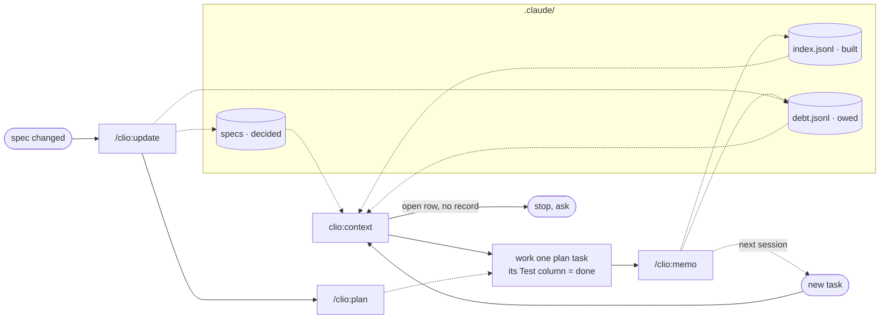

<div align="center">
  

  # Clio

  **A project-memory kit for `.claude/`: layout, ledgers, and the loop that keeps them true.**
  Claude reads what was decided, built and owed before it works, and asks instead of guessing.

  Not auto-memory, not a skills pack, not a code generator. Nothing is written unless you ran a command.

  [](https://code.claude.com/docs/en/plugins)
  [](CHANGELOG.md)
  [](LICENSE)
</div>

<br>

Start a task in an area Clio knows, and this is what Claude reads before touching code:

```text
clio:context checkout

Spec      memory/checkout.md · rows 3–5 · row 4 open: tax rounding rule owed by PO since 08-12
Built     2026-08-20 checkout-orders.md — GET /orders, pagination 50/page (commit 3f2a1c)
Owed      cart-rounding · code-debt · CartService.php:52 · blocked_by: null   ← work queue
          tax-rule-open · spec-blocked · waiting on PO                        ← do not start
Next      plan 3.3 — orders list filters by status · test: go test ./orders -run TestListFilter
```

Row 4 is open, so Claude asks about it instead of inventing a rounding rule.

## Why

Every session starts from zero. `CLAUDE.md` grows into a dump of rules, task notes and half-true
facts. The agent reads it all, still cannot tell what was *decided* from what was merely *built*,
and fills the gap with a plausible answer.

Clio fixes the layout, not the model. Each kind of knowledge gets one place, "unverified" becomes
a valid answer, and a short loop writes what happened back to disk before the session ends.

## Quick start

```bash
claude plugin marketplace add nhhthong/clio
claude plugin install clio@nhhthong
```

Then, once per repository:

```text
/clio:setup                  # lays out .claude/, fills CLAUDE.md and CONTEXT.md by asking you
/clio:ingest docs/spec.md    # optional: distil a requirement document into spec files
/clio:plan checkout          # optional: split one spec area into testable tasks
```

From there the loop runs itself: Claude runs `clio:context` before non-trivial work, you run
`/clio:memo` after it. Nothing reminds you.

Requires `bash`, `jq`, `git`, `awk`, `sed`. Plugin updates never touch your `.claude/`. Setup also
offers optional tooling (Context7, codebase-memory, Playwright, a DB MCP), one item per Clio rule
it serves. Nothing is pre-selected.

## What is in the kit

Three layers. The lower two stand on their own; the loop needs both.

| Layer | Holds | Use without the plugin? |
|---|---|---|
| **Layout** | `CLAUDE.md` / `CONTEXT.md` templates, `rules/<stack>.md` starters, a deny/ask permissions list, a formatter hook | yes, copy the files |
| **Ledgers** | `index.jsonl` (built), `debt.jsonl` (owed), the `requirements.md` register (decided), their schema and `validate.sh` | yes, if you write the schema by hand |
| **Loop** | the eight `clio:*` skills that read and write the layers above | no |

`/clio:setup` installs the first two layers into your repo once. The skills and the validator stay
in the plugin, so an update never touches your `.claude/`.

## How it differs

| | Clio | Auto-memory (claude-mem, mem0…) | Skills packs (mattpocock/skills, superpowers…) |
|---|---|---|---|
| Writes | only via `/clio:memo`, `/clio:update` | automatically, every session | CONTEXT.md / ADRs at most; no ledger |
| Installs into your repo | a layout you keep even if you drop the plugin | nothing | nothing |
| Format | append-only JSONL, validated | vector store / summaries | one `SKILL.md` per technique |
| Answers | decided? built? owed? joined on the requirement row | "what did we talk about" | how to do X well |

Closest neighbour is [beads](https://github.com/steveyegge/beads), also a JSONL ledger agents read
before working. Beads tracks only what is owed; Clio adds decided and built, and joins the three.

> **Why "Clio"?** In Greek myth, Clio is the Muse of history — one of nine daughters of Mnemosyne,
> the goddess of memory. Her job was to write down what actually happened, and to leave the line
> blank when nobody told her. That is the whole rule this kit enforces.

## The layout

Everything lives under `.claude/`. Three questions, one home each.

| | Path | Holds | Written by |
|---|---|---|---|
| **Decided** | `docs/specs/requirements.md` | one row per requirement → spec file → decided / open / blocked | humans, `/clio:update` |
| | `docs/specs/memory/*.md` | distilled decisions per area, each quoting its source | `/clio:ingest` |
| | `docs/plans/<area>.md` | decided rows split into the smallest testable tasks | `/clio:plan` |
| **Built** | `clio/index.jsonl` | one line per documented run, append-only; last line per doc is its current state | `/clio:memo` |
| | `docs/tasks/*.md` | one doc per feature, for life; updated, never forked | `/clio:memo` |
| | `docs/decisions/*.md` | ADRs | `/clio:memo` |
| **Owed** | `clio/debt.jsonl` | bugs, unverified work, open questions, append-only | `/clio:memo`, `/clio:update` |
| **Always loaded** | `CLAUDE.md` | rules only, ~80 lines; imports `CONTEXT.md`; domain vocabulary | you, `/clio:setup` |
| | `CONTEXT.md` | stable facts: entities, colliding terms, key flows, landmines | you, `/clio:memo` (with a yes) |
| | `rules/<stack>.md` | path-scoped, loads only for the files it names | you, `/clio:setup` |

The three ledgers join on `req`, the requirement row number. `.jsonl` files are append-only: an
update is a new line with the same `id`, and readers take the last. Only `CLAUDE.md` and
`CONTEXT.md` load every session; the rest is queried on demand, never read whole.

Already have a `.claude/`? Clio appends its import and one `## Project memory` block, then asks
whether to bring `CLAUDE.md`, `CONTEXT.md` and `rules/` to this layout. Yes: the diff is shown and
you confirm again before anything is written. No: nothing else is touched.

## The loop



Dotted lines are reads and writes. There is no hook and no reminder: skip `/clio:memo` and the
next session starts without it.

## Rules the layout enforces

- Not verified by reading, grepping, querying or running: say "unverified" and ask.
- **Decided ≠ built.** Decisions live in the spec register, build state only in the ledgers.
- Ledger lines are never edited, reordered or deleted. One feature, one doc, for life.
- A task is done when its named test ran, not when the code looks right.
- `blocked_by: null` is the work queue; anything else waits. Every open spec point has a debt record.

## Commands

| Command | Does | When |
|---|---|---|
| `/clio:setup` | lay out `.claude/`, fill CLAUDE.md / CONTEXT.md by asking | once per repo |
| `/clio:ingest <doc>` | requirement document → spec files + row table | new source arrives |
| `/clio:plan <area>` | decided rows → smallest testable tasks | after ingest, when a row moves |
| `/clio:context [x]` | no arg: where are we · with area / row / id / question: spec, built, owed, quoted | Claude, before work; you, to ask "why?" |
| `/clio:memo [doc]` | record finished work: task doc, ledgers, plan tick, ADR | after each feature or fix |
| `/clio:update [spec]` | a spec changed: what it invalidates, move the row marker | requirements change |
| `/clio:debt [filter]` | what is still owed, actionable vs. blocked | any time |
| `/clio:ask [x]` | explain any of the above | when unsure |

Nothing outside `.claude/` is touched. Without `.claude/clio/` the skills say so and stop.

<details>
<summary>Auto-enable for a team</summary>

Add to the project's `.claude/settings.json`; members get the plugin when they trust the repo.

```json
{
  "extraKnownMarketplaces": { "nhhthong": { "source": { "source": "github", "repo": "nhhthong/clio" } } },
  "enabledPlugins": { "clio@nhhthong": true }
}
```
</details>

## Contributing

Bugs and questions go to [Issues](https://github.com/nhhthong/clio/issues). Schema, validator and
read-side queries are kept in sync by hand; [CONTRIBUTING.md](CONTRIBUTING.md) says where each
lives and what to run before a PR. Every user-visible change gets a line in
[CHANGELOG.md](CHANGELOG.md).

## License

[MIT](LICENSE) © 2026 nhhthong

## Star History

<a href="https://www.star-history.com/?repos=nhhthong%2Fclio&type=date&legend=top-left">
 <picture>
   <source media="(prefers-color-scheme: dark)" srcset="https://api.star-history.com/chart?repos=nhhthong/clio&type=date&theme=dark&legend=top-left" />
   <source media="(prefers-color-scheme: light)" srcset="https://api.star-history.com/chart?repos=nhhthong/clio&type=date&legend=top-left" />
   
 </picture>
</a>
