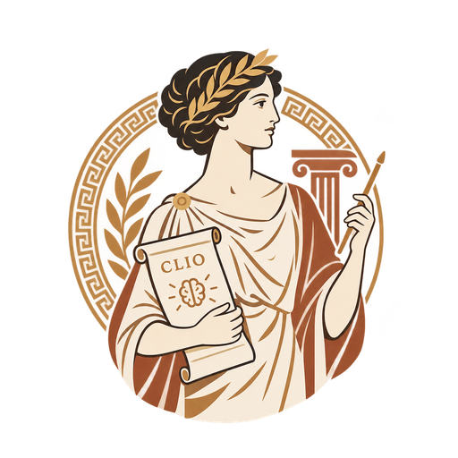

<div align="center">
  

  # Clio

  **Project memory for Claude Code.**  
  What was decided, what was built, what was proven, and what's still owed — stored under `.claude/` so the next session doesn't start from zero.

  Nothing is written automatically. You decide what gets recorded.

  [](https://code.claude.com/docs/en/plugins)
  [](https://www.python.org)
  [](CHANGELOG.md)
  [](LICENSE)
</div>

<br>

## The problem

Every Claude Code session starts cold. `CLAUDE.md` turns into a dumping ground, and the model has no clean way to tell decisions apart from implementation details. Gaps get filled with plausible guesses.

Clio doesn't change the model — it changes how project knowledge is organized. Each kind of knowledge has one place. "Unverified" is a valid answer. A short loop writes the session back to disk when you're done.

## `/clio:test` — done means proven

```text
/clio:test orders   # cases per task → you approve once → tests + code → run → gate
```

- **Tests chosen by risk.** Plan picks the levels a task needs (`unit`, `integration`, `api`, `e2e`, `concurrency`, `security`…). At least one case per level; skipping needs a written reason.
- **You approve the case list once.** That list is the definition of done. Expected values come from the spec, never from the code.
- **Evidence a model can't fake.** A script records results; a hook blocks other writes. For critical paths, tests must fail on the old code before they pass. The gate prints `OK` only when every case passes on the current code — `/clio:memo` ticks the task only then.

## Install

Requires Python 3.9+ (stdlib only) and git 2.5+.

```bash
claude plugin marketplace add nhhthong/clio
claude plugin install clio@nhhthong
```

Once per repository:

```text
/clio:setup                  # create .claude/clio/
/clio:ingest docs/spec.md    # spec → areas + proposed stack
/clio:plan infra             # stack → toolchain tasks
/clio:plan checkout          # one area → small testable tasks
```

Then for each task: `/clio:test`, then `/clio:memo`.  
Setup only writes under `.claude/clio/`.

## Layout

Four questions, one home each, all under `.claude/clio/`. Nothing here is loaded every session.

| | Holds | Written by |
|---|---|---|
| **Decided** | `docs/specs/` (requirements, per-area decisions, stack) and `docs/plans/` (tasks + test levels) | `/clio:ingest`, `/clio:plan` |
| **Built** | `database/index.jsonl`, `docs/tasks/`, `docs/decisions/` (ADRs) | `/clio:memo` |
| **Proven** | `database/runs.jsonl`, `docs/tests/` (approved cases) | `/clio:test` script only |
| **Owed** | `database/debt.jsonl` (bugs, open questions) | `/clio:memo`, `/clio:ingest` |

`.jsonl` ledgers are append-only. All four join on the requirement row number.

## The loop


```mermaid
flowchart LR
    A(["new task"]) --> B["clio:context"] --> T["/clio:test"] --> G["gate OK = done"] --> M["/clio:memo"] -. next session .-> A
    R(["spec changes"]) --> U["/clio:ingest"] --> P["/clio:plan"] --> T
```

Two hooks:

- `clio_nudge.py` — reminds once per session that a memo is still owed
- `clio_guard.py` — refuses any write to `runs.jsonl` except from `clio test`

Neither writes a ledger itself.

## Commands

| Command | What it does |
|---|---|
| `/clio:setup` | Create the layout (once per repo) |
| `/clio:ingest [doc]` | Requirements → specs and stack; on change, flags what existing code it invalidates |
| `/clio:plan <area>` | Specs → smallest testable tasks, each with its test levels (`infra` first) |
| `/clio:context [x]` | What's decided, built, and owed — before you start work |
| `/clio:test [task\|area]` | Design, approve, run, and gate the tests |
| `/clio:memo` | Record finished work; tick the plan only on a passing gate |

## License

[MIT](LICENSE) © 2026 nhhthong

## Star History

<a href="https://www.star-history.com/?repos=nhhthong%2Fclio&type=date&legend=top-left">
 <picture>
   <source media="(prefers-color-scheme: dark)" srcset="https://api.star-history.com/chart?repos=nhhthong/clio&type=date&theme=dark&legend=top-left" />
   <source media="(prefers-color-scheme: light)" srcset="https://api.star-history.com/chart?repos=nhhthong/clio&type=date&legend=top-left" />
   
 </picture>
</a>
