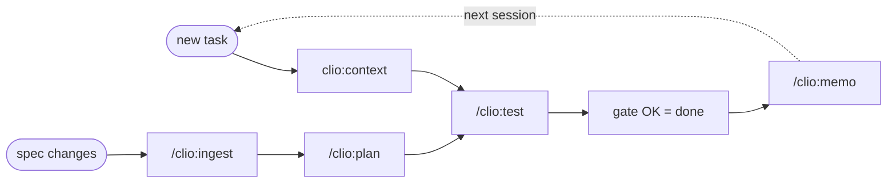

<div align="center">
  

  # Clio

  **Project memory for `.claude/`: what was decided, built, proven and owed. Claude reads it before working and asks instead of guessing.**

  Not auto-memory. Nothing is written unless you asked for it.

  [](https://code.claude.com/docs/en/plugins)
  [](https://www.python.org)
  [](CHANGELOG.md)
  [](LICENSE)
</div>

<br>

## `/clio:test` — a task is done only when it is proven

```text
/clio:test orders   # cases per task → you approve once → tests + code → run → gate
```

What makes it different:

- **Tests chosen by risk.** `/clio:plan` asks what each task touches (a database, a route, two writers,
  outside input…) and names the test levels it needs: `unit` `integration` `api` `contract` `e2e`
  `idempotency` `concurrency` `security` `resilience` `perf` `load` `stress` `regression` `smoke`
  `mutation`. `/clio:test` writes at least one case per level. Skipping a level needs a written reason.
- **Expected values come from the spec, never from the code.** No source for a value means no case,
  only an open question. Claude cannot grade its own homework.
- **You approve the case list once, up front.** That list is the definition of done. Change it later
  and the approval is void.
- **Red, then green, where it matters.** For bug fixes and critical tasks (money, auth, deletes,
  two writers on one record), every test must be seen failing before it passes. This proves the test
  can actually catch the bug, instead of passing by construction. Claude never breaks code by hand to
  get the red: `clio test red` runs the tests on the old code.
- **Evidence a model cannot fake.** A script runs the tests and records the result. A hook blocks any
  other write to it. Edit code after a pass and the pass no longer counts.
- **Flaky means failed.** One red run among the repeats fails the case. Re-running until green does not clear it.
- **Fast.** The runner is started once per batch, not once per case (Maven + Spring, 8 cases: 72 s → 11 s).

The gate (`clio test gate`) prints `OK` only when every case passed on the current code.
`/clio:memo` ticks the task only on `OK`.

## Why

Every session starts from zero. `CLAUDE.md` grows into a dump, and the agent cannot tell what was
*decided* from what was merely *built*, so it fills the gap with a plausible guess.

Clio changes the layout, not the model. Each kind of knowledge gets one place, "unverified" is a valid
answer, and a short loop writes the session back to disk.

## Install

Needs Python 3.9+ (standard library only) and git 2.5+.

```bash
claude plugin marketplace add nhhthong/clio
claude plugin install clio@nhhthong
```

Once per repository:

```text
/clio:setup                  # create .claude/clio/
/clio:ingest docs/spec.md    # spec → areas, stack proposed
/clio:plan infra             # stack → toolchain tasks
/clio:plan checkout          # one area → small testable tasks
```

Then per task: `/clio:test`, then `/clio:memo`. Setup writes only under `.claude/clio/`.

## The layout

Four questions, one home each, all under `.claude/clio/`. Nothing there loads every session.

| | Holds | Written by |
|---|---|---|
| **Decided** | `docs/specs/` (requirements, per-area decisions, the stack) and `docs/plans/` (tasks and their test levels) | `/clio:ingest`, `/clio:plan` |
| **Built** | `database/index.jsonl`, `docs/tasks/`, `docs/decisions/` (ADRs) | `/clio:memo` |
| **Proven** | `database/runs.jsonl`, `docs/tests/` (approved cases) | `/clio:test` script only |
| **Owed** | `database/debt.jsonl` (bugs, open questions) | `/clio:memo`, `/clio:ingest` |

`.jsonl` ledgers are append-only. All four join on the requirement row number.

## The loop


```mermaid
flowchart LR
    A(["new task"]) --> B["clio:context"] --> T["/clio:test"] --> G["gate OK = done"] --> M["/clio:memo"] -. next session .-> A
    R(["spec changes"]) --> U["/clio:ingest"] --> P["/clio:plan"] --> T
```

Two hooks: `clio_nudge.py` reminds Claude once per session that a memo is owed; `clio_guard.py` refuses
any write to `runs.jsonl` except from `clio test`. Neither writes a ledger.

## Commands

| Command | Does |
|---|---|
| `/clio:setup` | create the layout, once per repo |
| `/clio:ingest [doc]` | requirements → specs and the stack; on change, flags what built code it invalidates |
| `/clio:plan <area>` | specs → smallest testable tasks, each with its test levels; `infra` first |
| `/clio:context [x]` | what is decided, built and owed, before work |
| `/clio:test [task\|area]` | design, approve, run and gate the tests |
| `/clio:memo` | record finished work, tick the plan on a passing gate |

## License

[MIT](LICENSE) © 2026 nhhthong

## Star History

<a href="https://www.star-history.com/?repos=nhhthong%2Fclio&type=date&legend=top-left">
 <picture>
   <source media="(prefers-color-scheme: dark)" srcset="https://api.star-history.com/chart?repos=nhhthong/clio&type=date&theme=dark&legend=top-left" />
   <source media="(prefers-color-scheme: light)" srcset="https://api.star-history.com/chart?repos=nhhthong/clio&type=date&legend=top-left" />
   
 </picture>
</a>
